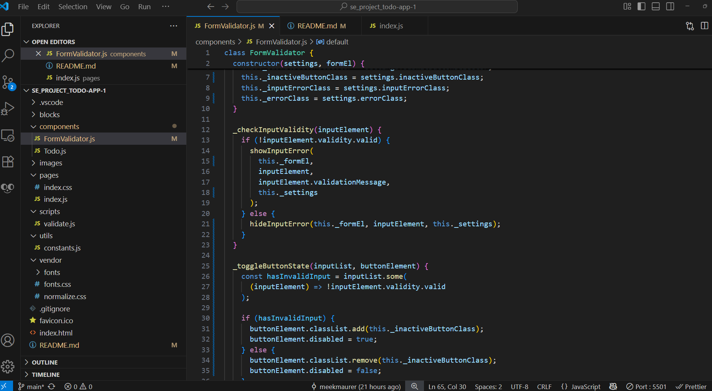
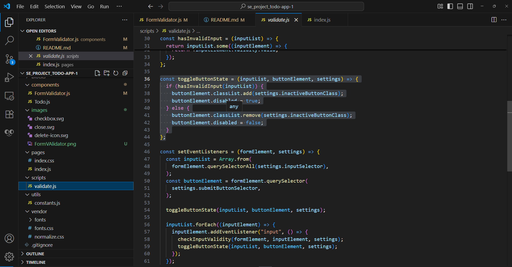

# Simple Todo App

This is a project to help deveplop the understandof the OOP methodology. As well as implementing modules. That where taught in the previous chapthers.

## Functionality

this project was to reifroce the addition of classes as well as modules in the OOP method. to help create a more efficent code as well as it being easier to undersstand when working with a possible team.

## Technology

here are some examples of the modueles that where used to work on this project.

## Deployment

This project is deployed on GitHub Pages:

- [ADD LINK HERE](https://meekmaurer.github.io/se_project_todo-app/)
